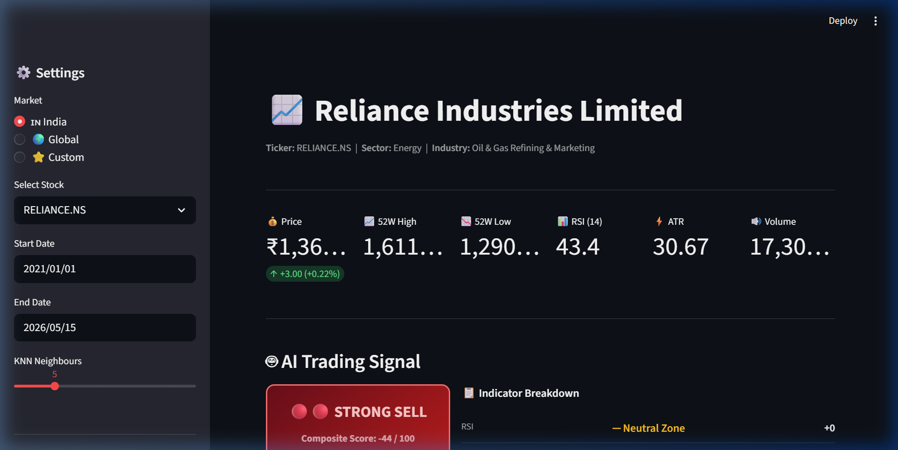
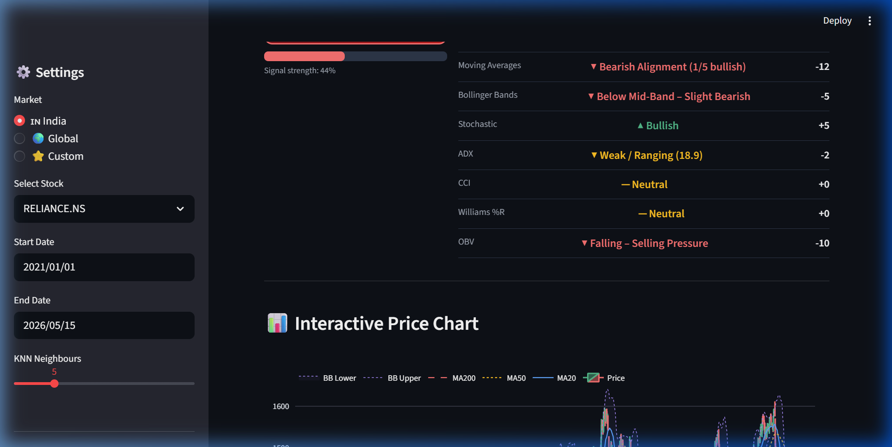
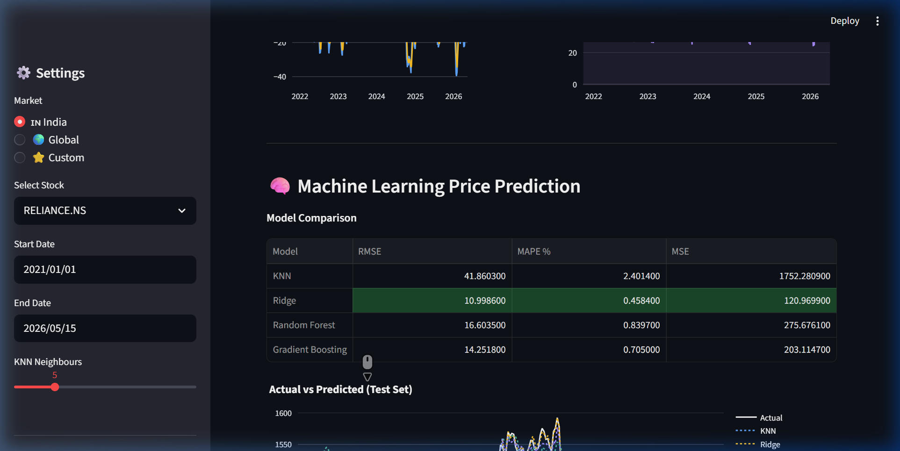

<div align="center">

# 📈 AI Stock Dashboard
**Intelligent, real-time stock analysis and price prediction engine**

[](https://www.python.org/)
[](https://streamlit.io/)
[](https://scikit-learn.org/)
[](https://plotly.com/)
[](LICENSE)

*Analyze Indian (NSE) and Global (US) stocks with composite AI signals, technical indicators, and machine learning models.*

[**Explore the Repository**](https://github.com/KrishnansuMohapatra/stock_knn)



</div>

---

## ✨ Features at a Glance

🔥 **Real-time Technical Analysis**
View interactive candlestick charts with overlays for Moving Averages (MA20, MA50, MA200) and Bollinger Bands.

🤖 **AI Trading Signals**
Get definitive Buy / Sell / Hold signals based on a sophisticated composite score aggregated from 9+ technical indicators (RSI, MACD, Stochastic, ADX, CCI, Williams %R, OBV, etc.).

🔮 **Machine Learning Price Predictions**
Predict next-day closing prices using an ensemble of 4 regression models:
*   **KNN Regressor** (Adjustable neighbors)
*   **Ridge Regression**
*   **Random Forest**
*   **Gradient Boosting**

📑 **Automated AI Reports**
Read natural-language analysis reports covering price summary, trend analysis, momentum, volatility, volume, and an overall assessment.

🗺️ **Market Heatmap**
Visualize 5-day return performance across major Indian and US stocks at a glance.

---

## 🧠 How the Signal Engine Works

Our bespoke signal engine aggregates individual indicators to formulate a **composite score ranging from -100 to +100**.

| Score Range | Signal | Interpretation |
|:---:|:---|:---|
| **+35 to +100** | 🟢🟢 **STRONG BUY** | Overwhelming bullish consensus across indicators. |
| **+15 to +34** | 🟢 **BUY** | Moderate bullish trend forming. |
| **-14 to +14** | 🟡 **HOLD / NEUTRAL** | Ranging market; conflicting signals. |
| **-34 to -15** | 🔴 **SELL** | Moderate bearish trend forming. |
| **-100 to -35**| 🔴🔴 **STRONG SELL** | Overwhelming bearish consensus across indicators. |

---

## 🚀 Quick Start Guide

### Prerequisites
- Python 3.11+
- Internet connection (for Yahoo Finance API)

### Installation (via `uv` - Recommended for Speed)

```bash
# 1. Clone the repository
git clone https://github.com/KrishnansuMohapatra/stock_knn.git
cd stock_knn

# 2. Sync dependencies
uv sync

# 3. Launch the dashboard!
uv run streamlit run app.py
```

### Installation (via `pip`)

```bash
# 1. Clone the repository
git clone https://github.com/KrishnansuMohapatra/stock_knn.git
cd stock_knn

# 2. Create and activate virtual environment
python -m venv .venv
# On Windows:
.venv\Scripts\activate
# On macOS/Linux:
source .venv/bin/activate

# 3. Install dependencies
pip install -r requirements.txt

# 4. Launch the dashboard!
streamlit run app.py
```

The app will open automatically at `http://localhost:8501`.

---

## 🛠️ Usage Tips

1. **Select Market:** Choose between `🇮🇳 India`, `🌍 Global`, or input a `⭐ Custom` ticker.
2. **Custom Tickers:** 
   - US Stocks: `AAPL`, `TSLA`
   - Indian NSE: Append `.NS` (e.g., `RELIANCE.NS`)
   - Crypto: Use Yahoo format (e.g., `BTC-USD`)
3. **Customize ML:** Adjust the KNN neighbors slider to see how the prediction changes in real-time.
4. **Tune Indicators:** Modify RSI overbought/oversold limits directly from the sidebar.

---

## 📸 Dashboard Previews

<div align="center">
  
  
</div>

---

## 📂 Project Structure

```text
stock_knn/
├── app.py              # Main Streamlit orchestrator
├── config.py           # Constants, tickers, feature lists
├── styles.py           # Dashboard CSS themes
├── data_loader.py      # Yahoo Finance API & caching layer
├── indicators.py       # Technical indicator mathematics
├── signals.py          # Composite scoring engine logic
├── ml_models.py        # Model training and inference
├── charts.py           # Plotly interactive visualizations
├── report.py           # Natural language report generation
└── requirements.txt    # Dependencies
```

---

## ⚠️ Troubleshooting

**"No data found. Check ticker / date range."**
- Verify the symbol on [Yahoo Finance](https://finance.yahoo.com).
- Ensure Indian stocks have the `.NS` suffix.
- Ensure your date range spans at least 200 trading days (required for the MA200 calculation).

**Missing stocks in the Heatmap**
- If a pre-loaded stock is delisted or renamed on Yahoo Finance, it is silently skipped to prevent the app from crashing.

---

## ⚖️ Disclaimer

> **For educational and research purposes only.** This tool does not constitute financial advice. Algorithmic signals and ML predictions can be wrong and are subject to market volatility. Always do your own research (DYOR) before making investment decisions.

---

<div align="center">
  <p>Built with ❤️ by <a href="https://github.com/KrishnansuMohapatra">Krishnansu Mohapatra</a></p>
</div>